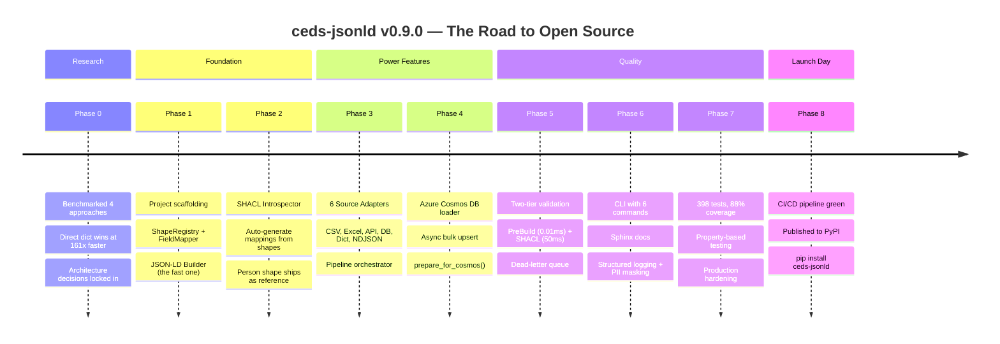

# ceds-jsonld v0.9.0 — The Road to Open Source

```mermaid
timeline
    title ceds-jsonld v0.9.0 — The Road to Open Source
    section Research
        Phase 0 : Benchmarked 4 approaches
                : Direct dict wins at 161x faster
                : Architecture decisions locked in
    section Foundation
        Phase 1 : Project scaffolding
                : ShapeRegistry + FieldMapper
                : JSON-LD Builder (the fast one)
        Phase 2 : SHACL Introspector
                : Auto-generate mappings from shapes
                : Person shape ships as reference
    section Power Features
        Phase 3 : 6 Source Adapters
                : CSV, Excel, API, DB, Dict, NDJSON
                : Pipeline orchestrator
        Phase 4 : Azure Cosmos DB loader
                : Async bulk upsert
                : prepare_for_cosmos()
    section Quality
        Phase 5 : Two-tier validation
                : PreBuild (0.01ms) + SHACL (50ms)
                : Dead-letter queue
        Phase 6 : CLI with 6 commands
                : Sphinx docs
                : Structured logging + PII masking
        Phase 7 : 398 tests, 88% coverage
                : Property-based testing
                : Production hardening
    section Launch Day
        Phase 8 : CI/CD pipeline green
                : Published to PyPI
                : pip install ceds-jsonld
```
